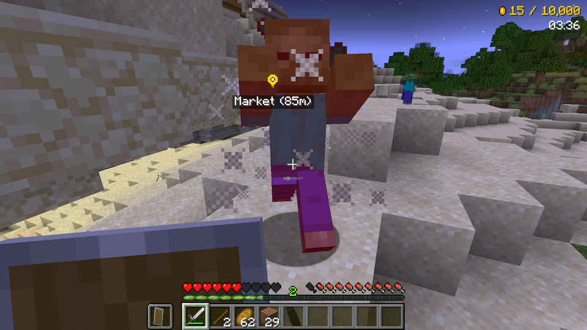

# Hunter's Market

**A competitive monster hunting mod for Minecraft**

Hunt monsters, collect loot, sell to the merchant, and be the first to earn 10,000 gold! Built with Architectury for cross-platform support (Fabric + NeoForge/Forge).



## Features

- **Competitive Monster Hunting**: Race against other players to be the first to earn 10,000 gold
- **NPC Merchant**: Sell your monster loot to a merchant NPC at the market
- **Auto-Generated Market**: A market structure spawns automatically at the world spawn point
- **Starter Equipment**: Iron Sword, Shield, and Bread provided on spawn
- **Night Vision**: Permanent night vision for all players
- **Real-Time HUD**: Track your earnings, play time, rankings, and market direction on screen
- **Multiplayer Support**: Designed for competitive multiplayer sessions with rankings and finish notifications

## Price List

| Item | Price | Item | Price |
|------|-------|------|-------|
| Rotten Flesh | 50 | Bone | 50 |
| Arrow | 25 | String | 25 |
| Spider Eye | 75 | Gunpowder | 75 |
| Ender Pearl | 100 | Glowstone Dust | 100 |
| Trident | 500 | | |

## Supported Versions

| Minecraft | Mod Loaders | Architectury API |
|-----------|-------------|------------------|
| 1.21.11 | Fabric / NeoForge | 19.0.1+ |
| 1.21.10 | Fabric / NeoForge | 18.0.8+ |
| 1.21.9 | Fabric / NeoForge | 18.0.3+ |
| 1.21.8 | Fabric / NeoForge | 17.0.8+ |
| 1.21.7 | Fabric / NeoForge | 17.0.8+ |
| 1.21.6 | Fabric / NeoForge | 17.0.6+ |
| 1.21.5 | Fabric / NeoForge | 16.1.4+ |
| 1.21.4 | Fabric / NeoForge | 15.0.3+ |
| 1.21.3 | Fabric / NeoForge | 14.0.4+ |
| 1.21.1 | Fabric / NeoForge | 13.0.8+ |
| 1.20.1 | Fabric / Forge | 9.2.14+ |

All versions require **Fabric API** when using Fabric. See `props/<version>.properties` for exact dependency versions.

## Requirements

### For Players
- **Minecraft**: Java Edition (see [Supported Versions](#supported-versions))
- **Mod Loader** (choose one):
  - **1.21.1+**: Fabric (with Fabric API) or NeoForge
  - **1.20.1**: Fabric (with Fabric API) or Forge
- **Dependencies**: Architectury API (version depends on Minecraft version)

### For Developers
- **Java Development Kit (JDK)**: 21 for 1.21.1+, 17 for 1.20.1 (auto-downloaded by toolchain)
- **IDE**: IntelliJ IDEA (recommended) or Eclipse

## Building from Source

```bash
git clone https://github.com/ksoichiro/HuntersMarket.git
cd HuntersMarket

# Build for a specific version
./gradlew build -Ptarget_mc_version=1.21.11

# Build all supported versions
./gradlew buildAll

# Full release (clean + buildAll + collectJars → build/release/)
./gradlew release
```

**Output Files**: `<platform>/<version>/build/libs/huntersmarket-*-<platform>.jar`
- Example: `fabric/1.21.11/build/libs/huntersmarket-*-fabric.jar`

## Development Setup

### Import to IDE

#### IntelliJ IDEA (Recommended)
1. Open IntelliJ IDEA
2. File → Open → Select `build.gradle` in project root
3. Choose "Open as Project"
4. Wait for Gradle sync to complete

### Run in Development Environment

```bash
# Fabric client (target version determined by gradle.properties or -P flag)
./gradlew :fabric:runClient

# NeoForge client (1.21.1)
./gradlew :neoforge:runClient

# Forge client (1.20.1)
./gradlew :forge:runClient -Ptarget_mc_version=1.20.1
```

## Installation

### Fabric (1.21.1+)
1. Install Fabric Loader and Fabric API for your Minecraft version
2. Install Architectury API (see [Supported Versions](#supported-versions) for the required version)
3. Copy the Fabric JAR to `.minecraft/mods/` folder

### NeoForge (1.21.1+)
1. Install NeoForge for your Minecraft version
2. Install Architectury API
3. Copy the NeoForge JAR to `.minecraft/mods/` folder

### Fabric (1.20.1)
1. Install Fabric Loader 0.16.10+ and Fabric API 0.92.2+1.20.1
2. Install Architectury API 9.2.14+
3. Copy the Fabric JAR to `.minecraft/mods/` folder

### Forge (1.20.1)
1. Install Forge 47.3.0+
2. Install Architectury API 9.2.14+
3. Copy the Forge JAR to `.minecraft/mods/` folder

## Project Structure

```
HuntersMarket/
├── common/
│   ├── shared/              # Shared version-agnostic sources (included via srcDir)
│   └── <version>/           # Common module per MC version (version-specific APIs)
├── fabric/
│   ├── base/                # Shared Fabric sources
│   └── <version>/           # Fabric subproject per MC version
├── neoforge/
│   ├── base/                # Shared NeoForge sources
│   └── <version>/           # NeoForge subproject per MC version (1.21.1+)
├── forge/
│   ├── base/                # Shared Forge sources
│   └── 1.20.1/              # Forge subproject for MC 1.20.1
├── props/                   # Version-specific properties
├── build.gradle             # Root build configuration (Groovy DSL)
├── settings.gradle          # Multi-module settings
└── gradle.properties        # Version configuration
```

## Technical Notes

- **Build DSL**: Groovy DSL (for Architectury Loom compatibility)
- **Mappings**: Mojang mappings (official Minecraft class names)
- **Shadow Plugin**: Bundles common module into loader-specific JARs
- **Persistence**: Uses `SavedData` to track game state across server restarts

## License

This project is licensed under the **GNU Lesser General Public License v3.0 (LGPL-3.0)**.

Copyright (C) 2025 Soichiro Kashima

See the [COPYING](COPYING) and [COPYING.LESSER](COPYING.LESSER) files for full license text.

## Credits

- Built with [Architectury](https://github.com/architectury/architectury-api)

## Support

For issues, feature requests, or questions:
- Open an issue on [GitHub Issues](https://github.com/ksoichiro/HuntersMarket/issues)

---

**Developed for Minecraft Java Edition 1.20.1 ~ 1.21.11**
